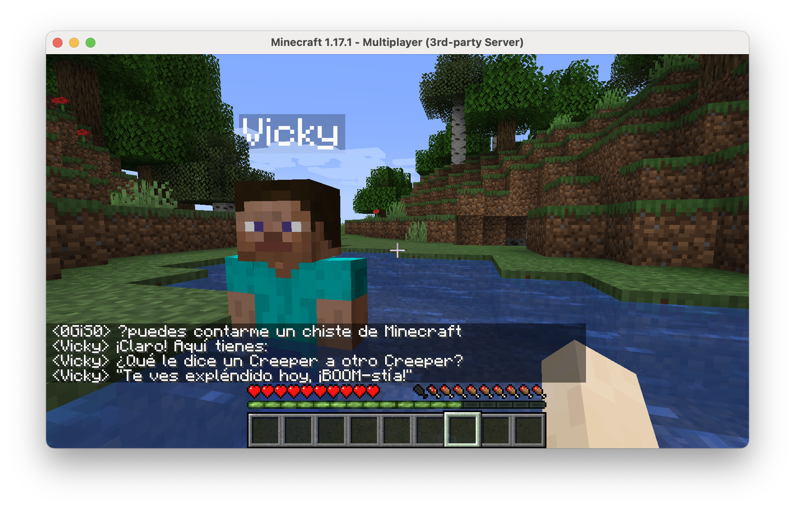

docker build -t cmendibl3/dapr.sensors.actors:0.1.0 -f .\dapr.actors.Dockerfile .
docker build -t cmendibl3/dapr.sensors.client:0.1.0 -f .\dapr.client.Dockerfile .
docker build -t cmendibl3/dapr.sensors.average:0.1.0 -f .\dapr.sensors.average.Dockerfile .
docker build -t cmendibl3/dapr.minecraft.poll:0.1.0 -f .\dapr.minecraft.poll.Dockerfile .


docker push cmendibl3/dapr.sensors.actors:0.1.0
docker push cmendibl3/dapr.sensors.client:0.1.0
docker push cmendibl3/dapr.sensors.average:0.1.0
docker push cmendibl3/dapr.minecraft.poll:0.1.0

terraform apply

---

env:DEBUG="minecraft-protocol"  

---

az containerapp revision deactivate --resource-group rg-cae-f51d --revision mc-server--x5gj7s6  --name mc-server
az containerapp revision activate --resource-group rg-cae-f51d --revision mc-server--x5gj7s6  --name mc-server

# Install Minecraft client to access the server

1. Download from https://www.minecraft.net/en-us/download

2. Login with your Microsoft account

3. Create a new installation with version **release 1.17.1**

4. Launch the installation and select the **Multiplayer** 

5. Click on **Direct Connection** and add **localhost:25565**

6. Your server is now running!


# Join bot to the server

1. Go to **minecraftbot** folder

```bash
cd minecraftbot
```

2. Run **npm install**

```bash
npm install
```

3. Now **npm start** to start the bot

```bash
npm start
```

4. Press 'T' to open the chat and type **come** to ask the bot to come to your position


5. To talk with ChatGPT use **?** before your message

